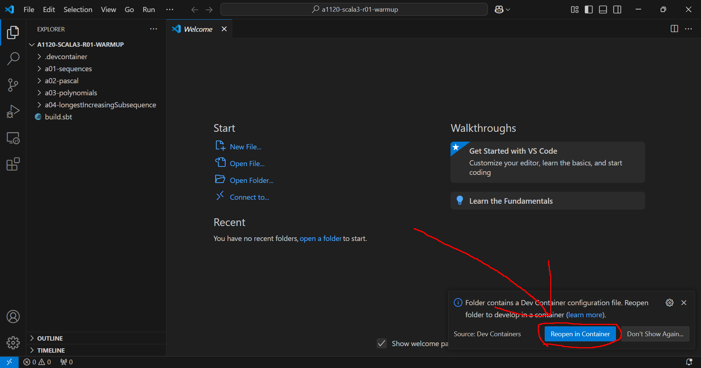

# Niksi user guide

## What is Niksi?

Niksi is a tool for creating Dev Container compatible docker development containers with Nix.

## Niksi installation

This guide covers installing Niksi for Windows running VSCode.
Niksi can be used in essentially any environment that runs Docker
but other operating systems and development environments
are out of this guides scope.

### Windows

1. Install Visual Studio Code

The VSCode installer is found [here](https://code.visualstudio.com/).

2. Install the "Dev Containers" extension for VSCode

[The extension](https://marketplace.visualstudio.com/items?itemName=ms-vscode-remote.remote-containers)
can be installed from the Extension store located in the left sidebar of VSCode.

3. Open a course module

A notification should appear in the bottom left corner with the button "Reopen in container".
Click that button. After that VSCode will launch the Niksi dev container and open the project there.

If the notification doesn't appear, you can manually open the container by running the VSCode command `Dev Containers: Rebuild and Open in Container`
The command prompt can be opened with the shortcut `Ctrl+Shift+P`

If WSL or Docker isn't installed, they will be installed while launching the container.
If WSL is installed, a reboot is usually needed. (This, too, requires patience)
If the installation gets stuck for a long time, restarting VSCode might help.
VSCode or Windows might prompt for permissions for the installs.

Once the project is open in the Dev Container, you can proceed with the normal VSCode workflow documented [here](TODO).
Note that you will not have to install anything to your computer.

NOTE: The dev container image might be large so make sure you have a good internet connection

NOTE 2: This image, in all likelihood, only has to be downloaded once during the course. Each exercise round will use the same image.

## Troubleshooting

### Workaround for non-ascii usernames

The VSCode Dev Containers plugin by Microsoft [fails to install WSL and Docker for Windows users with non-ascii characters (e.g. "öäå") in their name.](https://github.com/microsoft/vscode-remote-release/issues/10454)
The failure is indicated by the following error:

The workaround for this is to install WSL manually.

Run `wsl --install --no-distribution` in Windows Terminal and then restart your computer.
Then proceed with opening the course module.

### If Docker installation fails
try `Dev Containers: Reinstall Docker in WSL` then restart vscode

### Running tests fails

If you get this error while running tests, try running them again.

